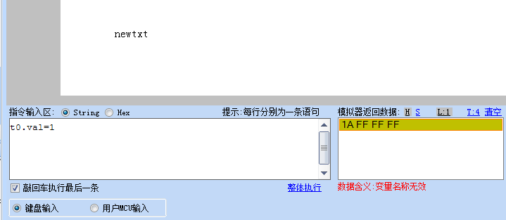
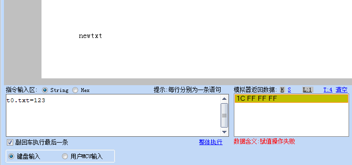

18.单片机发指令给屏幕，屏幕返回1A FF FF FF或1C FF FF FF四个字节的HEX数据
========================================================================================================================

1A FF FF FF

如下图：模拟器已经帮我们翻译了，变量名称无效，因为t0控件并没有val属性，t0.val这是个无效的变量

1C FF FF FF

如下图：模拟器已经帮我们翻译了，赋值操作失败，因为t0.txt是字符串类型。赋值常亮必须加引号，所以赋值失败

关于详细的赋值操作请参阅文档：指令集->书写语法->赋值操作
