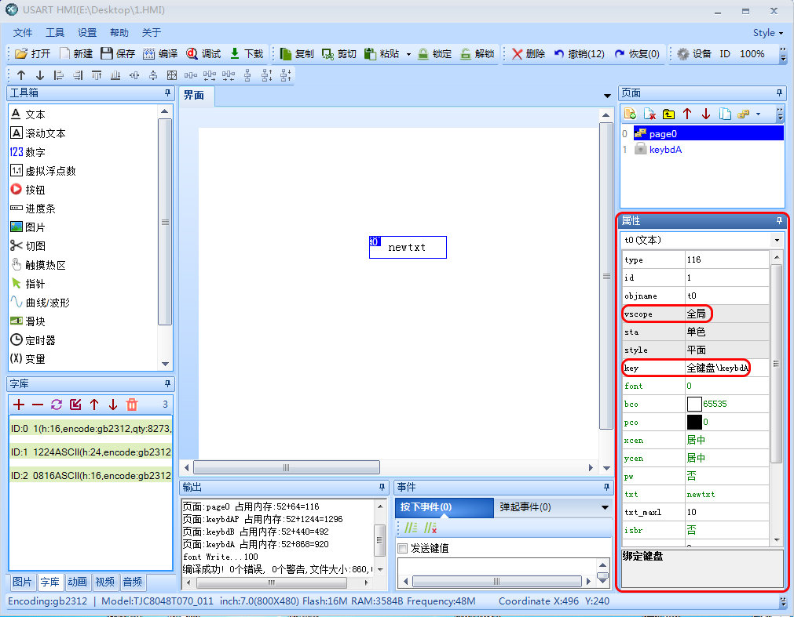
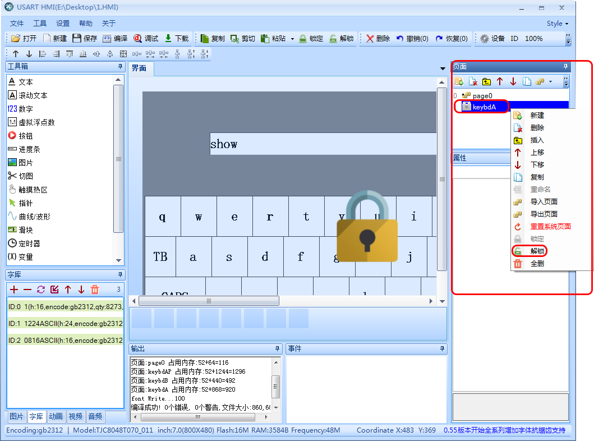

19.系统内置的触摸键盘怎么修改风格
============================================================

1.先找到要需要修改的内置键盘：新建一个文本控件，把文本（vscope）属性改为全局，在文本（key）属性选择自己所需键盘的大致风格。

2.选择完后页面会自动出现一个键盘页面，而且是有上锁的标志，此时选定右击选择解锁。

3.解锁完以后就可以按照自己想要的风格布局及代码修改，当然修改完以后你还可以对键盘右击锁定，锁定会提示输入密码，不填默认无，如果填了，不小心忘记了密码，选定右击重置会回来系统默认的键盘状态。

