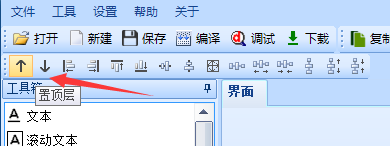

28.如何更改控件的前后图层关系
============================================================

◆图层的前后关系跟控件ID是关联的，图层最底层的控件ID最小,图层顶层的控件ID最大，每个控件占用一个图层，所有控件通过ID来区别前后关系。(每页UI最底层的是“页面”所以页面ID永远是0)。使用快捷栏的“置顶”、“置底”功能便可使控件ID发生变化 (图层关系也同时发生相应的变化)。如下图:

◆所有控件的ID号软件自动生成，用户在编辑UI界面时，按放置控件的顺序自动连续分配ID；在属性项中不能手动修改。

◆控件ID及图层关系只在编辑界面可以修改，运行中无法修改。

