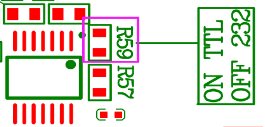

3.通讯口电压多少V，是否可以直接接5V单片机
============================================================

TTL 通讯：X系列通讯口电压为3.3/5V ，T0K0系列为3.3V ，都可以直接接5V单片机

232通讯： X系列是兼容TTL和232的，如果要用232通讯，要把R59这个电阻焊掉，此时是不可以直接接单片机的（单片机一般只带ttl电平的串口，需要接一个ttl转232的转换芯片才能和去掉R59电阻的串口屏连接）

