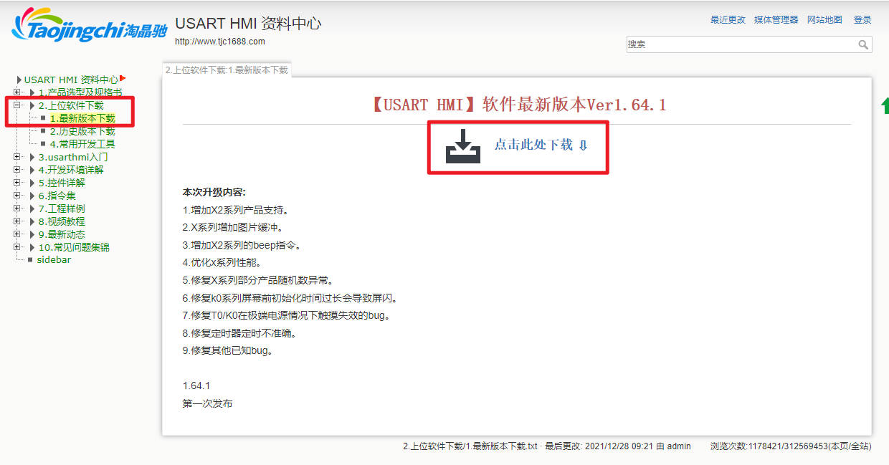
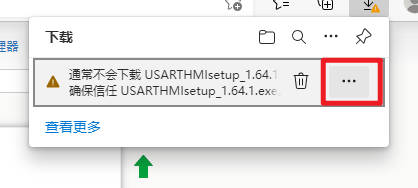
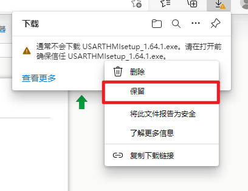
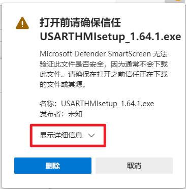
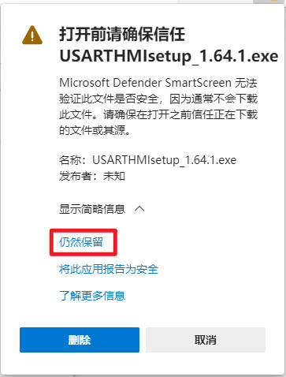

.. toctree::
   :maxdepth: 1

第一章：下载上位机软件
================================================================

所有的淘晶驰软件都可以从淘晶驰资料中心下载到：

`http://wiki.tjc1688.com/ <http://wiki.tjc1688.com/>`_

1.1下载上位机软件USART HMI
打开淘晶驰资料中心
`http://wiki.tjc1688.com/ <http://wiki.tjc1688.com/>`_

点击2.上位机软件下载-1.最新版本下载，点击此处下载，即可下载淘晶驰上位机软件USART HMI

.. attention:: 如果您使用WIN10自带的EDGE浏览器，可能会提示文件不信任，请按照以下方法进行处理

1.点击右侧三个点图标

2.点击保留

3.点击显示详细信息

4.点击仍然保留

