3.与单片机(stm32 + Keil MDK 5)联调
================================================================

使用的单片机型号为stm32f103c8t6的最小系统板

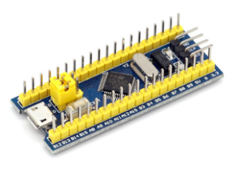

通过手册我们查找到,PA9为TX,PA10为RX

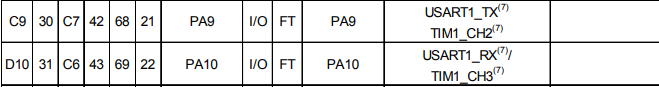

连接方式如下所示

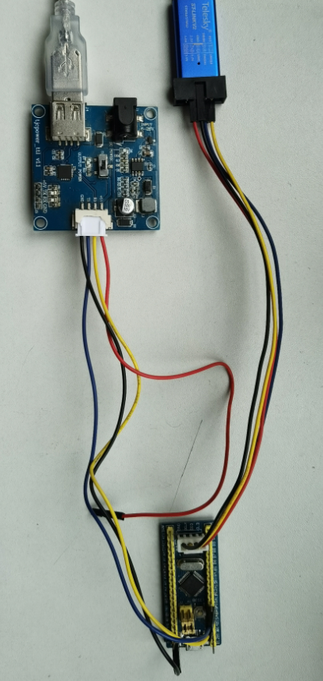

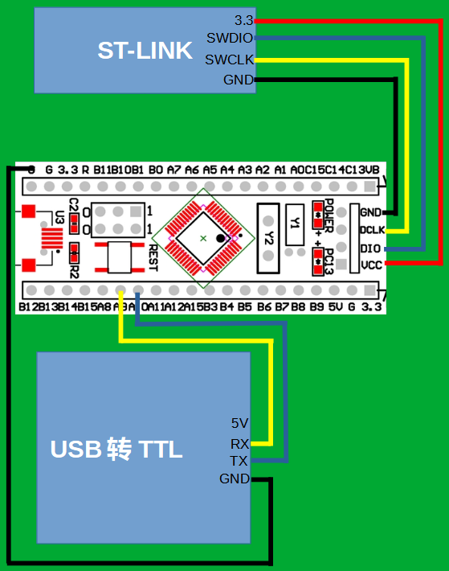

回到串口屏上位机软件中,新建一个数字控件,并调整位置和大小

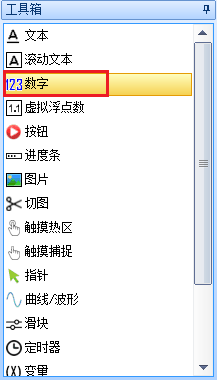

此时屏幕上最显眼的两个控件分别是t0(文本控件)和n0(数字控件)

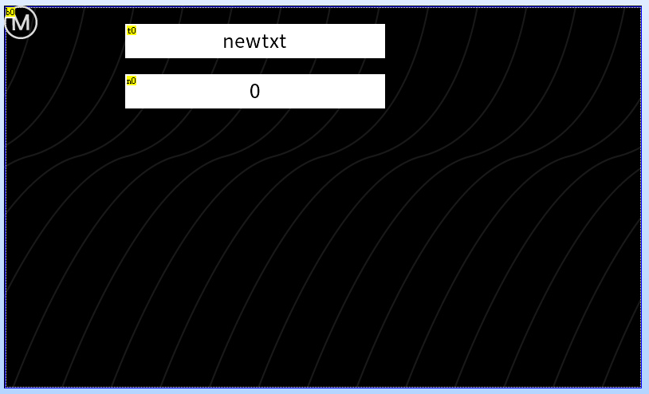

我们再建立一个setting页面,用于演示跨页面赋值

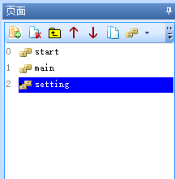

setting页面的sta设置为图片,pic属性设置为1

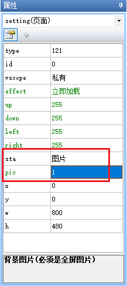

在setting页面上放置一个数字控件count,放置一个按钮b0

将数字控件count赋值为全局变量

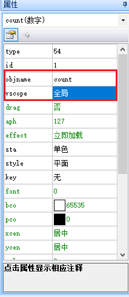

b0的txt属性设置为"返回主页面"

b0控件的弹起事件中写入跳转到主页面的指令

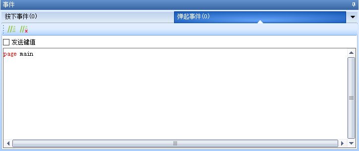

代码如下

.. code-block:: sh
   :emphasize-lines: 0
   :linenos:

    page main

切换到main页面,新建一个按钮b1,b1的txt属性赋值为"设置"

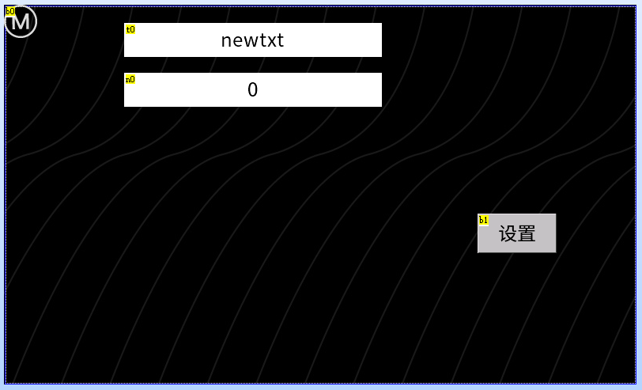

b1按键的弹起事件中写入跳转到设置页面的指令

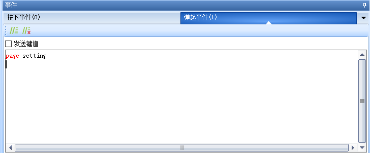

切换到program.s中,配置波特率/亮度/串口指令执行状态返回

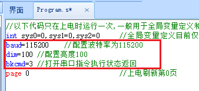

program.s中完整代码如下所示

.. code-block:: c#
   :emphasize-lines: 0
   :linenos:
    
    //以下代码只在上电时运行一次,一般用于全局变量定义和上电初始化数据
    int sys0=0,sys1=0,sys2=0     //全局变量定义目前仅支持4字节有符号整形(int),不支持其他类型的全局变量声明,如需使用字符串类型可以在页面中使用变量控件来实现
    baud=115200    //配置波特率为115200
    dim=100 //配置亮度100
    bkcmd=3 //打开串口指令执行状态返回
    page 0  //上电刷新第0页

.. attention:: 指令必须写在page指令前面,page后面的指令是不会执行的

keil工程代码如下所示

.. code-block:: c
   :emphasize-lines: 0
   :linenos:

    /*********************************************************************************/	 
    //STM32串口屏示例程序
    //更多资料：http://wiki.tjc1688.com/
    //单片机STM32F103C8T6  波特率：115200							  
    /*********************************************************************************/	

    #include "delay.h"
    #include "sys.h"
    #include "usart.h"	
    #include <string.h>

    void HMISends(char *buf1);
    void HMISendb(u8 buf);
    void beepms(u16 va);

    u8 key,beep;
    int a = 0;

    void beepms(u16 va)
    {
        beep=1;
        delay_ms(va);
        beep=0;
    }

    void HMISendstart(void)
        {
            //向串口屏发送 00 ff ff ff 来结束单片机初始化期间IO翻转导致的屏幕接收到的错误数据,以保证屏幕可以正常解析第一帧数据
            delay_ms(200);
            USART_SendData(USART1,0x00);  //发送0x00
            while(USART_GetFlagStatus(USART1,USART_FLAG_TXE)==RESET){};//等待发送结束
            USART_SendData(USART1,0xff);  //发送0xff
            while(USART_GetFlagStatus(USART1,USART_FLAG_TXE)==RESET){};//等待发送结束
            USART_SendData(USART1,0xff);  //发送0xff
            while(USART_GetFlagStatus(USART1,USART_FLAG_TXE)==RESET){};//等待发送结束
            USART_SendData(USART1,0xff);  //发送0xff
            while(USART_GetFlagStatus(USART1,USART_FLAG_TXE)==RESET){};//等待发送结束
            delay_ms(200);
        }
                            
    int main(void)
    {	   	 
        delay_init();	    	 //延时函数初始化	  
        NVIC_Configuration(); 	 //设置NVIC中断分组2:2位抢占优先级，2位响应优先级
        uart_init(115200);	  	 //串口初始化为115200
        HMISendstart();          //清空串口屏里的指令
        
        while(1)
        {
            //-----------------------------发送变化的字符开始--------------------------------
            
            //定义一个字符串数组
            char tjcstr[100];
            
            /********示例1:给文本控件赋值**********
            用sprintf来格式化字符串,给t0的txt属性赋值，
            给控件的文本属性赋值时,内容需要用成对的 \" \" 包裹住,
            当格式化的参数为字符串时，请保证字符串以\0结尾
            *****************************************/
            sprintf(tjcstr, "t0.txt=\"现在是%d\"", a);

            //把字符串发送出去
            HMISends(tjcstr);

            //发送结束符
            HMISendb(0xff);
            
            
            /********示例2:给数字控件赋值**********
            //用sprintf来格式化字符串，给n0.val属性赋值，同时加上结束符,
            请注意给val属性赋值时,是没有 \" \" 的,
            当格式化的参数为字符串时，请保证字符串以\0结尾
            *****************************************/
            sprintf(tjcstr, "n0.val=%d\xff\xff\xff", a);
            
            //把字符串发送出去
            HMISends(tjcstr);
            
            //不用发送结束符,因为结束符已经被整合在字符串中了
            
            
            
            /********示例3:跨页面赋值**********
            //用sprintf来格式化字符串，setting页面的count.val自增，同时加上结束符,
            请注意跨页面赋值时,需要把控件设置为全局,
            *****************************************/
            sprintf(tjcstr, "setting.count.val++\xff\xff\xff");
            
            //把字符串发送出去
            HMISends(tjcstr);
            
            //不用发送结束符,因为结束符已经被整合在字符串中了		
            
            
            //延时1000ms
            delay_ms(1000);
            a++;

            //-------------------------------------发送变化的字符结束-------------------------------------			
        }
    }
    
    //字符串发送函数
    void HMISends(char *buf1)		  
    {
        u8 i=0;
        while(1)
        {
            if(buf1[i] != 0)
            {
                USART_SendData(USART1,buf1[i]);  //发送一个字节
                while(USART_GetFlagStatus(USART1,USART_FLAG_TXE)==RESET){};//等待发送结束
                i++;
            }
            else
            {
                return ;
            }
        }
    }

    //字节发送函数
    void HMISendb(u8 k)		         
    {		 
        u8 i;
        for(i=0; i<3; i++)
        {
                if(k != 0)
                {
                    USART_SendData(USART1,k);  //发送一个字节
                    while(USART_GetFlagStatus(USART1,USART_FLAG_TXE)==RESET){};//等待发送结束
                }
                else
                {
                    return ;
                }
        } 
    } 

.. attention:: 使用sprintf格式化字符串时,请保证参数为%s(即字符串)时,是以\0结尾的字符串,否则将导致输出错误的结果

将程序下载到单片机后,将单片机通过USB转TTL小板连接到电脑上,通过设备可以查到当前的串口号为com99

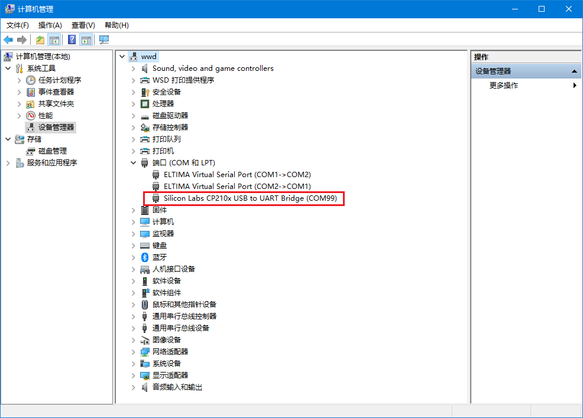

点击调试进入串口屏的调试模式,可以看到串口屏顺利接收并解析了单片机发来的数据

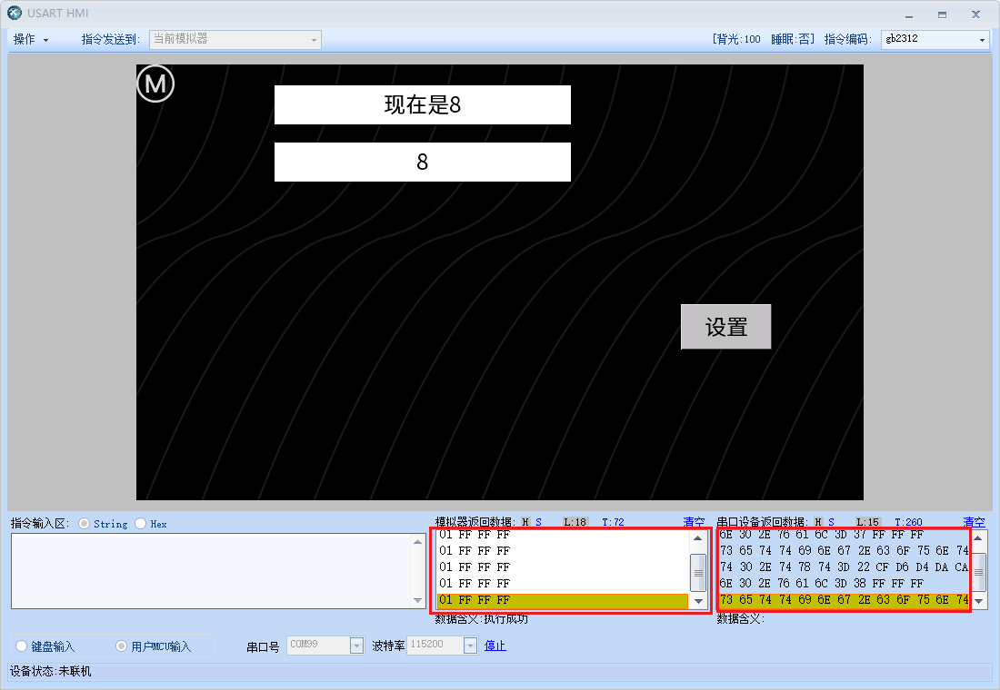

可以点击S按钮,查看对应的字符串格式的数据,可以看到单片机发送出来的数据是65,屏幕上显示的数据也是65

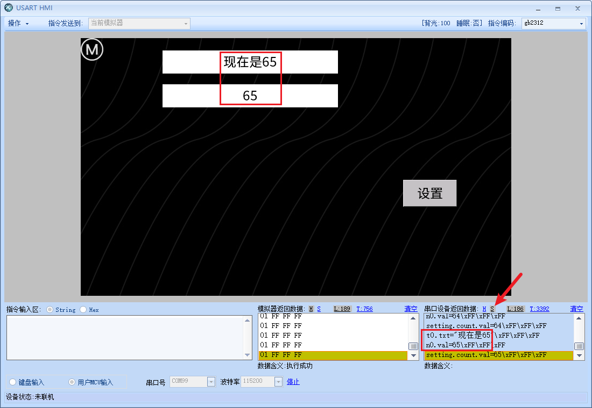

点击"设置"按键切换到设置页面,可以看到全局变量count也是在不断的自增

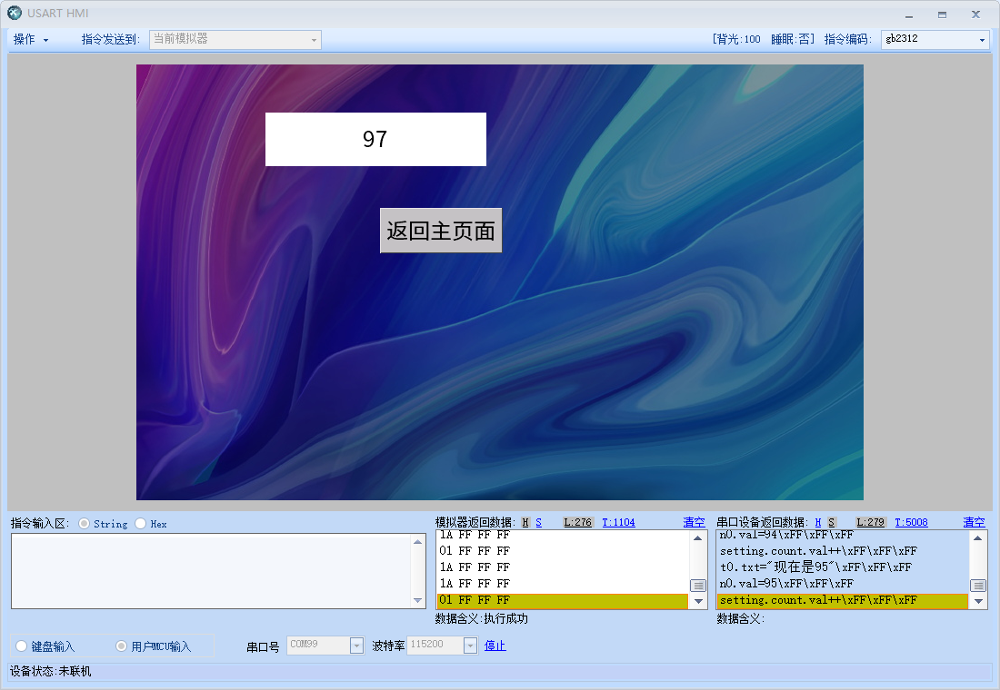

同时我们也会看到一些报错信息,因为当前页面没有文本控件t0和数字控件n0,因此单片机提示变量名称无效

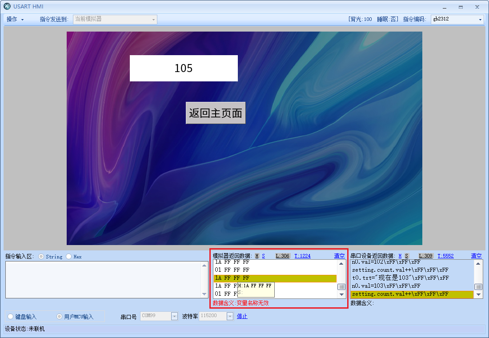

.. tip:: 建议需要由单片机通过串口传输给串口屏的变量设置为全局变量,并且以页面名称.控件名.属性的方式来赋值,例如setting.count.val=100
