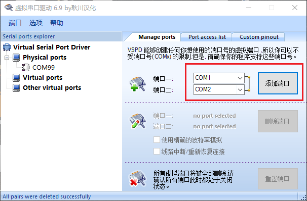
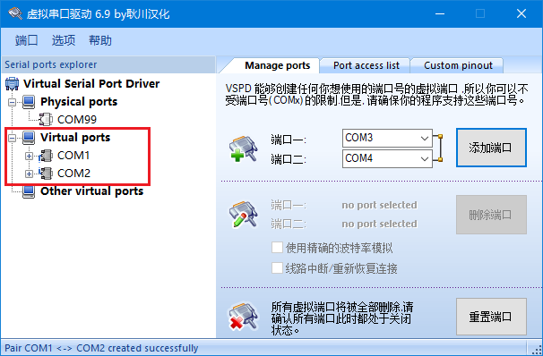
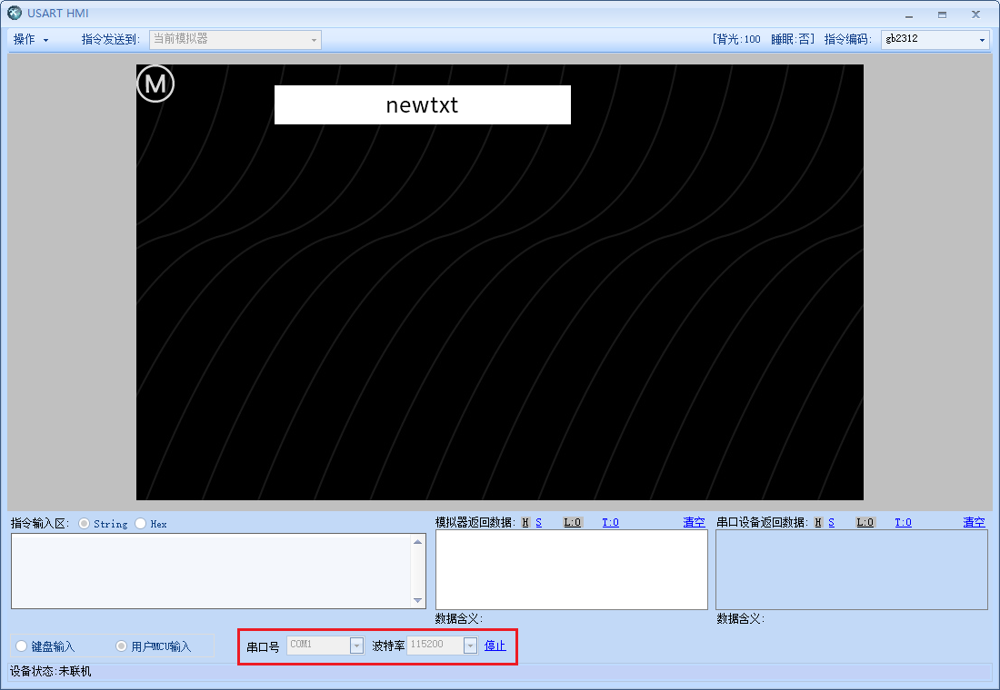
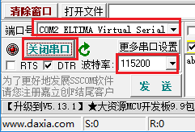
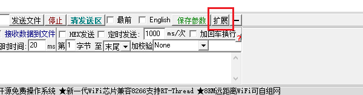
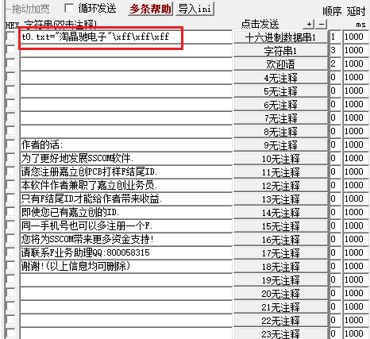
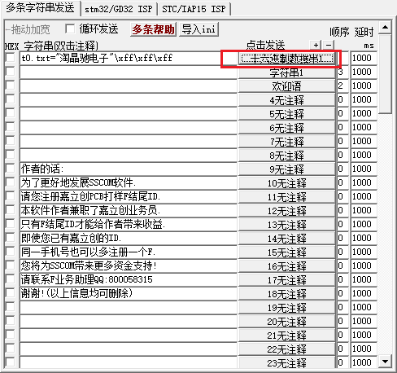
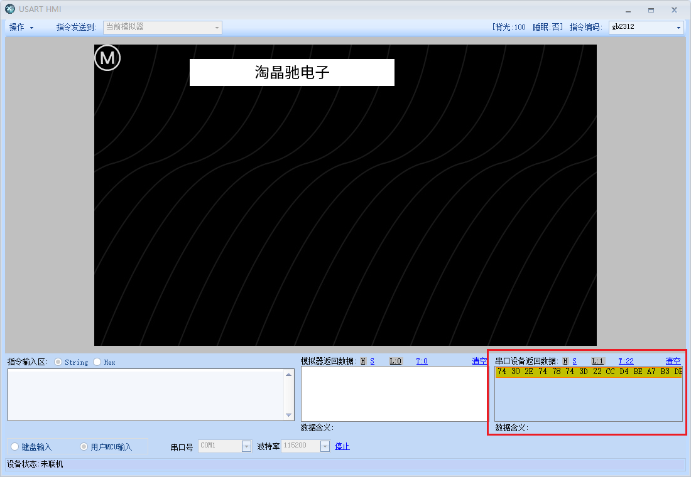

2.与串口工具联调
================================================================

`VSPD软件下载 <http://filedown.tjc1688.com/USARTHMI/gongju/VSPD.zip>`_

在安装好了VSPD之后,添加一对虚拟串口

添加后如图所示

进入串口屏调试界面,选择用户mcu输入,串口号选择com1,波特率115200,点击开始

打开sscom,串口号选择com2(与com1互为1对串口),波特率115200,点击打开串口

点击拓展按钮,让侧边栏显示出来

将第一栏编辑为如下指令,注意去掉前面的勾选

.. attention:: \\xff\\xff\\xff是结束符

指令如下:

.. code-block:: sh
   :emphasize-lines: 0
   :linenos:

    t0.txt="淘晶驰电子"\xff\xff\xff

点击右侧按钮即可发送当前指令

此时右下角可以看到接收到了数据,同时t0文本也变成了淘晶驰电子

.. hint:: 用户mcu输入功能可以用来连接其他的串口软件或者单片机
