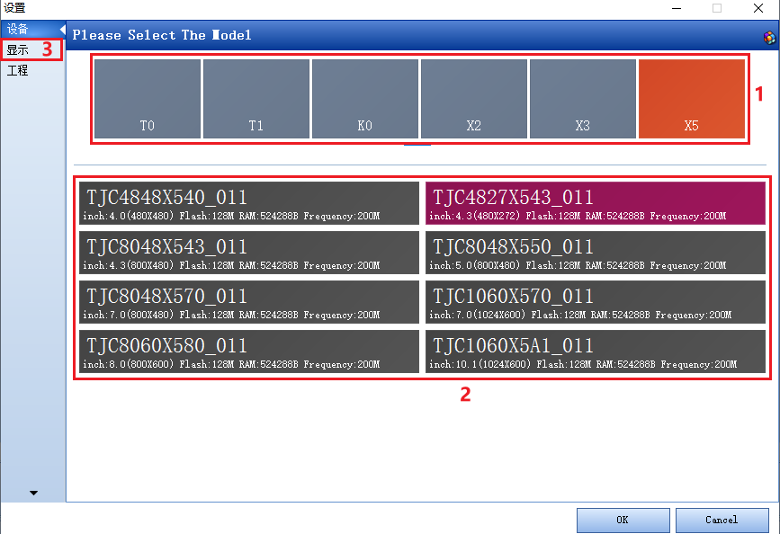
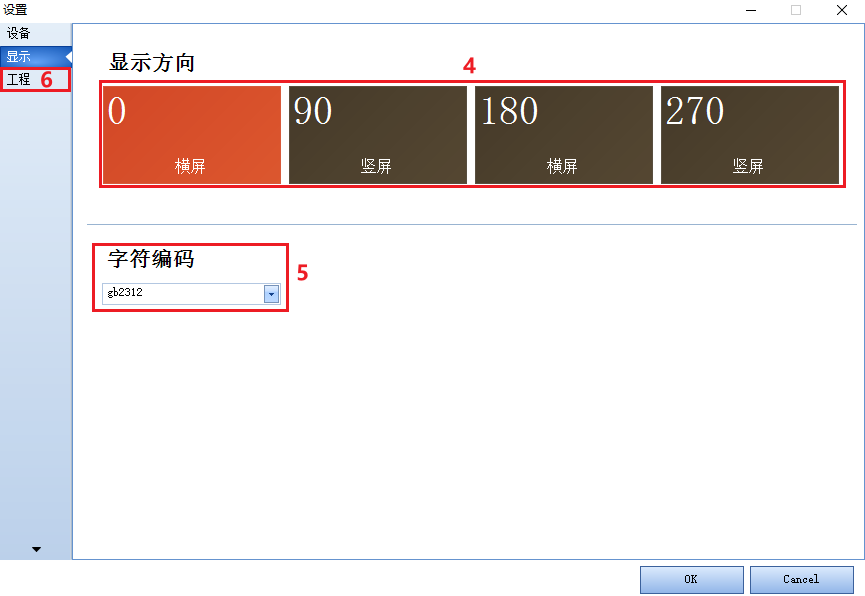
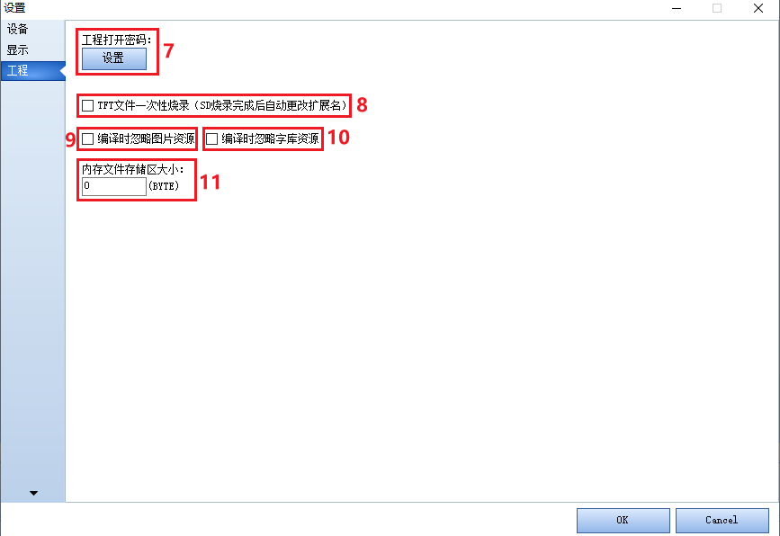

13.设备窗口
================================================================

设备窗口在工具栏中“设备”按钮，点击就可以进入到设备窗口。

13.1 工程设备型号

设备窗口

13.1.1 产品系列
   软件会根据推出产品系列实时更新目前拥有的产品系列，选择产品型号，下方会出现具体的产品型号。

13.1.2 产品型号
   选择产品系列会在该窗口出现工程具体型号（产品型号命名）。选择工程具体型号，点击ok。软件会根据型号自动生成工程窗口。

.. attention:: 下载工程进屏，如果工程型号和屏型号不匹配会出现model does not match。

13.1.3 显示窗口

13.1.4显示方向
   屏幕支持0 90 180 270四个显示方向。

.. attention:: 工程不支持运行中改变显示方向。

13.2.5 字符编码
   工程字符编码，目前支持：ascii，gb2312，big5，shift-jis，utf-8。

.. attention:: 字符编码不一致时会出现乱码。

13.2.6 工程窗口

13.3.7 工程密码
   设置打开工程是否需要密码，默认是没有密码的（设置密码后如果忘记密码，工程将无法找回，请慎用）。

13.3.8 tft文件烧录
   仅x系列支持
   设置sd卡里tft文件是否烧录后修改文件名，用于一次性烧录工程到屏上。

13.3.9 内存文件存储区
   如果需要使用ram，在这设置为至少大于65kB=65560Byte。
