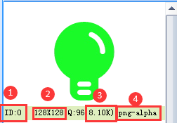
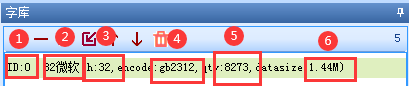
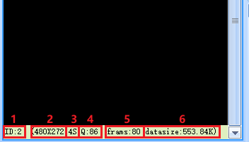
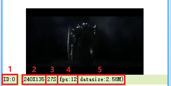

4.资源文件窗口
================================================================

资源文件窗口存放工程所调用到资源。其中动画，音频仅x系列支持，视频仅x5系列支持。

4.1 图片资源
图片资源：t0 t1系列支持jpg bmp； k0系列支持jpg bmp；x系列支持jpg png gif bmp；

如图所示,可以使用相关按钮进行图片添加，删除，替换，插入，上移，下移，全删。

4.1.1.图片id
   控件背景调用图片使用到的id。

4.1.2.图片分辨率
   导入图片分辨率超出屏幕显示支持最大分辨率将会报错。

4.1.3.图片压缩质量
   压缩质量越大，图片显示效果越好，但是占用的空间会更大

4.1.4.图片大小
   x5,x3,t1系列支持图片压缩储存，k0,t0系列不支持图片压缩储存（储存图片最小为分辨率：长*宽*2 bit）。

4.1.5.图片格式
   导入图片的图片格式。

▶4.2 字库资源

.. tip:: 字库：可以通过工具菜单中的《字库制作》工具制作

如图所示,可以使用相关按钮进行字库添加，删除，替换，插入，上移，下移，全删。

4.2.1.字库id
   控件字库调用字库使用到的id。

4.2.2.字库名称
   生成字库的时候进行命名。

4.2.3.字体大小
   该字库的字体大小。

4.2.4.字体字符编码
   该字库使用的字符编码。

4.2.5.字符数量
   字库所包含的字符数量。

4.2.6.flash空间
   字库所占flash空间大小。

4.3 动画资源
动画：可以通过工具菜单中的动画制作

如图所示,可以使用相关按钮进行动画添加，删除，替换，插入，上移，下移，全删。

4.3.1.动画id，动画控件调用动画使用到的id。

4.3.2.动画分辨率，导入动画分辨率超出屏幕显示支持最大分辨率将会报错。

4.3.3.动画时长。

4.3.4.动画压缩质量。

4.3.5.动画帧数。

4.3.6.动画所占flash空间大小。

4.4 视频资源

.. tip:: 视频：可以通过工具菜单中的视频/音频转换

如图所示,可以使用相关按钮进行视频添加，删除，替换，插入，上移，下移，全删。

4.4.1.视频id，视频控件调用视频使用到的id。

4.4.2.视频分辨率，导入动画分辨率超出屏幕显示支持最大分辨率将会报错。

4.4.3.视频时长。

4.4.4.视频fps。

4.4.5.视频所占flash空间大小。

4.5 音频资源

.. tip:: 音频：可以通过工具菜单中的《视频/音频》转换

如图所示,可以使用相关按钮进行音频添加，删除，替换，插入，上移，下移，全删。

4.5.1.音频id，音频控件调用音频使用到的id。

4.5.2.音频名称，生成音频的时候进行命名。

4.5.3.音频采样率

4.5.4.音频时长。

4.5.5.音频所占flash空间大小。

.. attention:: 音频格式必须用上位机自带的《视频/音频转换》转换为wav格式。