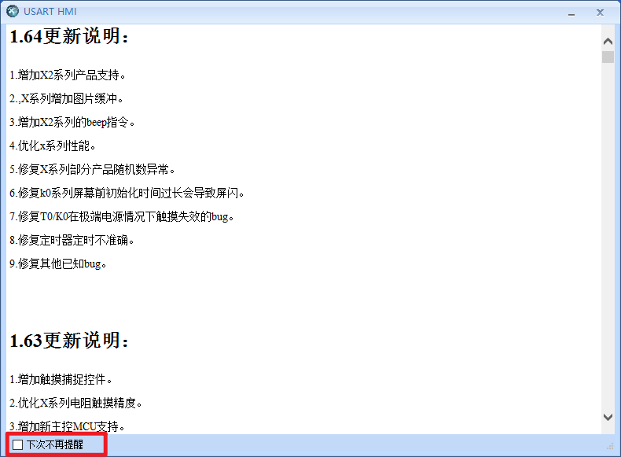
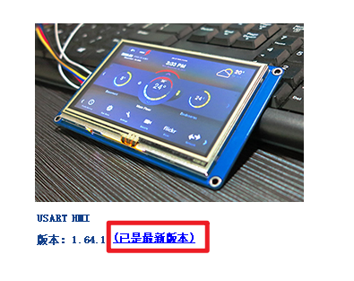
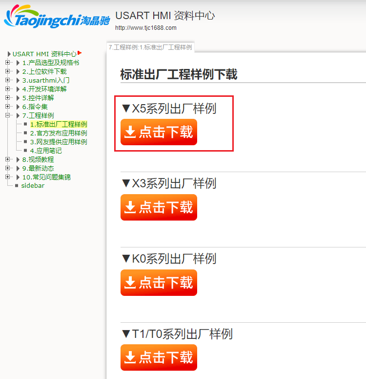
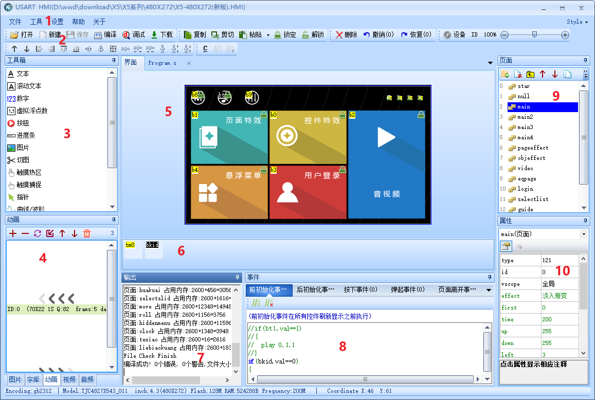

第三章：上位机基本功能介绍
================================================================

.. hint:: 本章内容较多，可以选择性观看，建议先看第四章：创建工程

双击桌面上的USART HMI图标即可打开上位机

.. tip:: 首次打开时会弹出更新说明，可以点击左下角的下次不再提醒，永久关闭更新说明提醒框

可以通过主界面上的提示来知道当前是否为最新版本，建议所有用户都更新到最新版本

.. hint:: USART HMI软件为淘晶驰智能串口屏集成开发环境。该集成开发环境包含串口屏界面设计，调试等界面开发软件的所有功能。下方截图使用的工程可以从淘晶驰资料中心-7.工程样例-1.标准出厂工程样例-X5系列出厂样例中找到

集成开发环境大致分为几大功能区，如下图所示。

.. toctree::
   :maxdepth: 1
   
   f_ide_introduce/ide_introduce1
   f_ide_introduce/ide_introduce2
   f_ide_introduce/ide_introduce3
   f_ide_introduce/ide_introduce4
   f_ide_introduce/ide_introduce5
   f_ide_introduce/ide_introduce6
   f_ide_introduce/ide_introduce7
   f_ide_introduce/ide_introduce8
   f_ide_introduce/ide_introduce9
   f_ide_introduce/ide_introduce10
   f_ide_introduce/ide_introduce11
   f_ide_introduce/ide_introduce12
   f_ide_introduce/ide_introduce13

