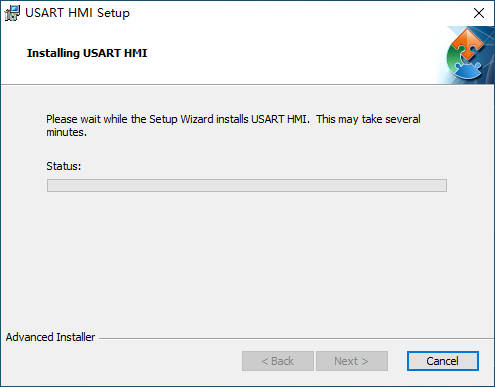

.. toctree::
   :maxdepth: 1

第二章：安装上位机软件
================================================================

1.双击安装下载完成的可执行文件，点击更多信息

.. image:: ../media/1/2_1.jpg

2.点击仍要运行

3.点击Next

4.此处建议使用默认的安装地址即可，点击Next

5.点击Install

6.等待程序安装完成

部分电脑因为没有.NET Framework 3.5 环境，需要联网安装.NET Framework 3.5 环境，点击下载并安装此功能

8.等待程序自动下载并安装

9.安装完毕点击关闭

