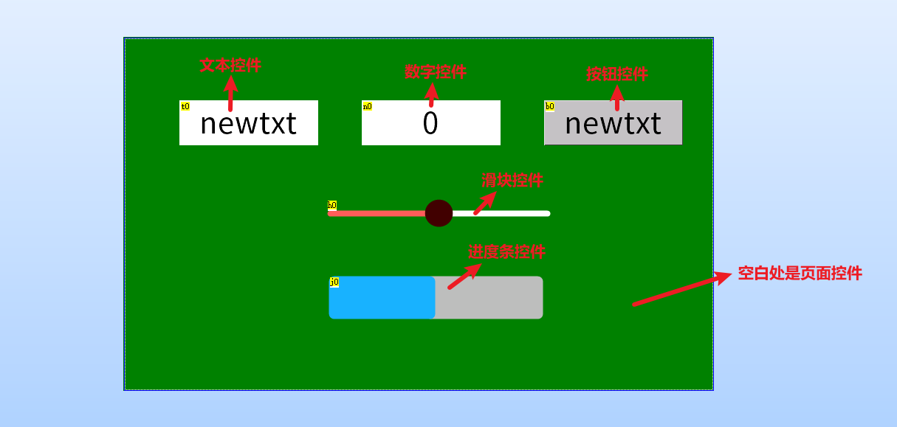

页面控件
===============================================================

一、页面控件-概述
~~~~~~~~~~~~~~~~~~~~~~~~~~~~~~~~~~~~~~~~~~~~~~~~~~~~~~~~~~~~~~~

在上位机软件中每新建一个页面,会自动在页面中创建一个页面控件,其id固定为0,页面控件名称与页面名称一致

串口屏所有控件操作的实质都是对属性的修改。页面控件具有的属性如下表所示。

.. image:: ../media/widget_interpretation/2_1.png

如下图所示，当鼠标选中对应属性时，会在属性窗口的最下方出现该属性的详细描述信息

.. tip:: 可以通过设置页面的up/down/left/right属性来设置上划下划左划右划分别跳转到哪个页面

.. hint:: 控件的属性分为黑色和绿色,黑色为不可调整或者只能在上位机中编辑,绿色属性可以通过指令进行修改

认识控件
~~~~~~~~~~~~~~~~~~~~~~~~~~~~~~~~~~~~~~~~~~~~~~~~~~~~~~~~~~~~

一、 控件是什么？
---------------------------------------------------------------

控件是串口屏想实现相关功能的“功能组件”，需要串口屏显示什么内容就使用相对应的控件。

例如：

    显示文本，用【文本控件】

    显示图片，用【图片控件】

    显示进度，用【进度条控件】

    实现按键功能，用【按钮控件】

    实现滑动功能，用【滑块控件】

    要播放视频，用【视频控件】

    ••• •••

在串口屏上位机的界面编辑窗口中,一切你能看到的,都是控件

选中任一控件,可以在左下角看到其属性栏

控件属性有2中颜色,分别为绿色和黑色

绿色属性:控件编辑时可设置+运行中可改变 

黑色属性:控件编辑时可设置（运行中不可改变）

.. hint:: type属性不可设置,objname属性不可读取,id属性需要通过左上角置顶置底按钮才能进行更改

二、 控件种类有多少？
---------------------------------------------------------------

《USART HMI》，目前已有“30种”控件，具体是哪些控件请打开软件查看控件“工具箱”查阅（控件工具箱位置如下图所示），同时我们根据市场需求会持续增加新控件。

.. image:: ../media/widget_interpretation/3_6.jpg

三、 控件属性是什么？
---------------------------------------------------------------

1、控件属性描述

控件属性是控件自己的一些设置项，上面提到想要什么功能就选择对应的控件，比如想要显示文本，就用文本控件，但是选择文本控件后，显示什么内容？什么字体？字体什么颜色？文本背景什么颜色？字体间距多少等等这些信息怎么设置呢？这就需要属性来定义了，这些信息都属于这个文本控件的属性，每个控件都有很多属性可以设置，用来定义他的显示风格。

通过对属性的简单编辑，便可将控件设置成您需要的效果；

2、控件属性读写

.. code-block:: sh
   :emphasize-lines: 0
   :linenos:

    sys0=t0.id              将文本控件t0的id号赋值给sys0变量
    t0.x+=10                将文本控件在屏幕上的位置向右移动10个像素点(仅X系列支持)。
    prints t0.txt,0         将t0的文本内容从串口发送出去。

四、 控件事件是什么？
---------------------------------------------------------------

控件事件，指的是这个控件被操作时要执行的功能。

目前各种控件综合起来被操作的方式有以下几种类型：

1、触摸被按下：对应名称叫做【按下事件】

2、触摸被按下后弹起：对应名称叫做【弹起事件】

3、滑块控件被滑动：对应的名称叫做【滑动事件】

4、定时器定时运行：对应的名称叫做【定时事件】

5、动画播放完成：对应的名称叫做【播放完成事件】

6、视频播放完成：对应的名称叫做【播放完成事件】

