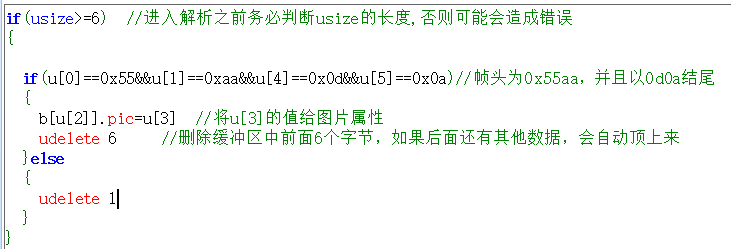

一.主动解析模式应用详解
===============================================================

屏幕上电默认是被动解析模式，所有串口指令需按照指令集中的格式来对屏幕进行操作，假如你需要自定义协议，不按照指令集格式来发串口数据给屏幕，而使用你自定义的格式，那么就需要把屏幕配置为主动解析模式。要使用此功能，请务必确保你有以下2点基础：

1.明白什么叫HEX,什么叫String,什么叫ASCII,分别什么关系，怎么转换。     

2.明白单字节数值，双字节数值，四字节数值，分别有什么区别，它们在内存中是什么样的储存方式，明白什么叫小端模式，什么叫大端模式。明白低位在前是什么含义。                                             

如果以上2点你都比较明白，那么请继续往下看，否则强烈建议不要再继续往下看了，因为大多数的项目是用不上这个功能的，使用默认的被动解析模式就可以了，没必要配置为下面的主动解析模式。

此篇幅涉及到以下几个内容:

1.串口数据解析模式系统变量:recmod

2.串口缓冲区数据大小系统变量:usize

3.串口缓冲区数据组:u[index]

4.串口缓冲区数据拷贝指令:ucopy

5.串口数据解析模式退出密码 

1.串口数据解析模式系统变量recmod(0为被动解析模式，1为主动解析模式)

屏幕上电recmod为0，即被动解析模式，在此模式下，外部设备按照标准指令集的指令格式发送串口指令给屏幕执行；如果你将recmod 设置为1(可以在上电默认页的初始化事件中写上recmod=1即可)，那么屏幕进入主动解析模式，然后所有的串口指令都不会被执行(注意：是串口指令不会被执行，上位软件编辑界面时写入事件中的固件指令是不会受影响的，依然正常执行)，所有的串口数据均存放在串口缓冲区中，等待您去主动读取。每次读完数据后，使用udelete指令删除缓冲区中已经读取的字节数，否则缓冲区溢出后就无法接收新数据。

.. attention:: 用上位机软件模拟器联机屏幕，屏幕将会强制退出主动解析模式，此时需要将屏重新上电才可以正常模拟器联机调试屏幕。

2.串口缓冲区数据大小系统变量usize(只能读取，不可设置)

读取此变量可以知道当前串口缓冲区已经缓存多少数据。 

定时器里每次进入解析之前，必须先判断usize的值大于1个数据帧的长度，才能进入正常的解析！！！

以下代码仅供参考

3.串口缓冲区数据组

串口缓冲区数据组的写法为u[index]   (index为序号)

例1：从缓冲区中0位置开始获取一个1字节的数值，赋值给数字控件n0, 写法如下:

.. code-block:: c#
   :emphasize-lines: 0
   :linenos:

   n0.val=u[0]

例2: 从缓冲区中0位置开始获取一个2字节的数值(小端模式，低位在前)，赋值给数字控件n0, 写法如下:

.. code-block:: c#
   :emphasize-lines: 0
   :linenos:

   n0.val=u[1]
   n0.val<<=8
   n0.val+=u[0]

例3: 从缓冲区中0位置开始获取一个4字节的数值(小端模式，低位在前)，赋值给数字控件n0, 写法如下:

.. code-block:: c#
   :emphasize-lines: 0
   :linenos:

   n0.val=u[3]
   n0.val<<=8
   n0.val+=u[2]
   n0.val<<=8
   n0.val+=u[1]
   n0.val<<=8
   n0.val+=u[0]

难道对一个4字节的整型变量赋值缓冲区中的内容只能是分4次单字节赋值再加3次移位吗？ 当然不是！当然有更方便的做法，请继续往下看!             

4.串口缓冲区数据拷贝指令ucopy

格式: ucopy,att, srcstar, lenth, decstar

说明：将串口缓冲区中的数据拷贝到变量中(recmod=1模式下有效)

att:目标变量名称

srcstar:串口缓冲区数据起始位

lenth:拷贝长度

decstar:目标变量数据起始位

此指令可以从串口缓冲区的指定位置连续拷贝指定数量的数据到目标变量(目标变量可以是字符串变量，可以是数值变量)。

例1：从缓冲区中0位置开始获取一个4字节的数值(小端模式，低位在前)，赋值给数字控件n0, 写法如下:

ucopy n0.val,0,4,0
udelete 4      删除缓冲区中前面4个字节，如果后面还有其他数据，会自动顶上来
温馨提示：每个数值变量系统都是按4字节分配内存，假如你使用ucopy从缓冲区获取小于4字节的数值，一定要注意剩余部分的字节数据处理，以免出现数据异常，操作方法请参考下面这个例子：

例2: 从缓冲区中0位置开始获取一个2字节的数值(小端模式，低位在前)，赋值给数字控件n0.val的低16位, 写法如下:

.. code-block:: sh
   :emphasize-lines: 0
   :linenos:

   n0.val=0
   ucopy n0.val,0,2,0     如果要赋值给高16位，就写成ucopy n0.val,0,2,2
   udelete 2      删除缓冲区中前面2个字节，如果后面还有其他数据，会自动顶上来

解释：先将n0.val赋值为0，目的在于确保n0.val的4个字节全置0，然后再从缓冲区拷贝2个字节进来，否则会因为你只拷了2字节而导致n0.val原来剩下的2字节数据还在，然后导致n0.val最终的数值并不是你想要的数值。

例3: 从缓冲区中0位置开始获取一个10字节的字符串，赋值给文本控件t0, 写法如下:

.. code-block:: sh
   :emphasize-lines: 0
   :linenos:

   if(usize>=10)             确保缓冲区数据大小足够10个
   {
      ucopy t0.txt,0,10,0
      udelete 10                删除缓冲区中前面10个字节，如果后面还有其他数据，会自动顶上来
   }

重要提示：code_c指令会将缓冲区数据清空，有可能会导致还没有读取的数据就被提前删除，所以在主动解析模式下建议使用udelete指令来删除已经读取的内容，而不要使用code_c指令。 

以上案例中使用的所有语句，指令，都是在上位编辑界面下，写入事件中的固件指令，串口一旦配置为主动解析模式，就不能再执行串口指令了，所以必须是由固件指令来操作读取串口数据，而不能是通过串口指令操作(否则就自相矛盾了)。 

5.退出主动解析模式

常规的退出主动解析模式方法是在事件中写入recmod=0的固件指令，如果想通过串口数据来退出，串口发送recmod=0是肯定没有用的，可以通过发送一串退出密码来实现退出主动解析模式,退出密码为一串24字节的字符串+3字节的结束符。

24字节的字符串:

DRAKJHSUYDGBNCJHGJKSHBDN  (字符串数据，必须大写)

3字节的结束符(Hex数据)：

0xff 0xff 0xff        

合计27字节

`主动解析-点灯 点击下载 <http://filedown.tjc1688.com/USARTHMI/demo_prj/Activeanalysis.zip>`_

