网友提供应用样例
================================================================

.. attention:: 以下样例为网友提交,我们不保证每一个例子都能完全正常使用，仅做参考!

1.多功能测量仪
~~~~~~~~~~~~~~~~~~~~~~~~~~~~~~~~~~~~~~~~~~~~~~~~~~~~~~~~~~~~~~~~~~~~~~~~~~~~~

素材说明：界面华丽，带有示波器功能。

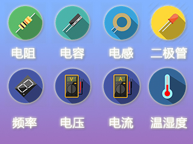

------------

2.超声波水位控制
~~~~~~~~~~~~~~~~~~~~~~~~~~~~~~~~~~~~~~~~~~~~~~~~~~~~~~~~~~~~~~~~~~~~~~~~~~~~~

素材说明：

    单片机：STC15F2K60S2*2，1302模块*1.18B20模块*1.1路继电器模块5V*1.交流接触器220V*1.

    1.水位实时显示，和百分比显示。

    2.温度日期星期和时间显示。

    3.时间设置，水位设置。

    4.两种水位控制，手动和自动。

    5 .两种保护，超时和满水自动停止。

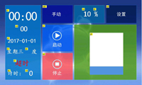

------------

3.全键盘输入、密码登录
~~~~~~~~~~~~~~~~~~~~~~~~~~~~~~~~~~~~~~~~~~~~~~~~~~~~~~~~~~~~~~~~~~~~~~~~~~~~~

素材说明：
    1、全键盘输入，支持大小写切换，数字，字符。

    2、密码登录，利用EEPROM保存，修改密码。

    3、进入设置页面的万能密码为890327。

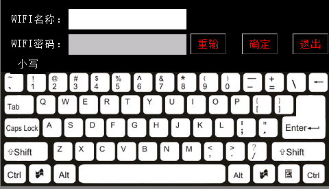

------------

4.简易计算器 点击下载
~~~~~~~~~~~~~~~~~~~~~~~~~~~~~~~~~~~~~~~~~~~~~~~~~~~~~~~~~~~~~~~~~~~~~~~~~~~~~

素材说明：

    第一次接触串口屏，就随便做了个简易计算器，试试手，免MCU控制。
    不支持负数和小数点，计算过大或出现负数时会有溢出问题。

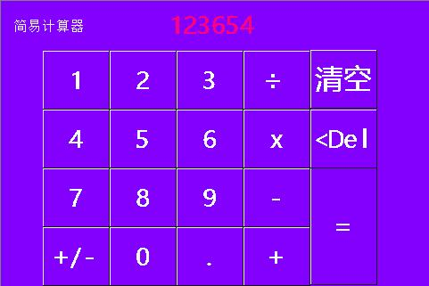

------------

5.打兔子，无需单片机支持
~~~~~~~~~~~~~~~~~~~~~~~~~~~~~~~~~~~~~~~~~~~~~~~~~~~~~~~~~~~~~~~~~~~~~~~~~~~~~

素材说明：
    根据前面的打兔子修改，无需单片机支持，直接运行，增加时间显示。

------------

6.电压数据采集及系统参数设置
~~~~~~~~~~~~~~~~~~~~~~~~~~~~~~~~~~~~~~~~~~~~~~~~~~~~~~~~~~~~~~~~~~~~~~~~~~~~~

素材说明：
    该案例单片机电压显示已有很多案例，不再多言，主要是屏本身参数设定。有如下功能：
    1休眠时间：通过双态按钮实现休眠的开关功能。当休眠开时，可以通过cal界面来设置休眠时间；当休眠关时，休眠时间设置无效。
    2工作时间：当屏处于非休眠状态时，可以一直“不间断”地记录工作时间。这里不间断是指切换页面的过程，它也一直保持工作。
    3背光亮度：通过改变滑块的位置改变屏背光的亮度。

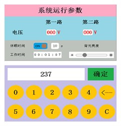

------------

7.温度读取显示
~~~~~~~~~~~~~~~~~~~~~~~~~~~~~~~~~~~~~~~~~~~~~~~~~~~~~~~~~~~~~~~~~~~~~~~~~~~~~

素材说明：
    使用DS18B20读取温度，并发送到，进度条，文本，控件实现显示效果
    单片机使用STC89C52晶振11.0592
    温度读取引脚P3.7（应按照自己的学习板进行调整）波特率9600

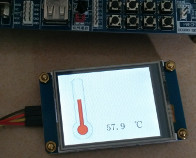

------------

8.串口屏控制3路继电器
~~~~~~~~~~~~~~~~~~~~~~~~~~~~~~~~~~~~~~~~~~~~~~~~~~~~~~~~~~~~~~~~~~~~~~~~~~~~~

素材说明：
    这个案例主要通过printh指令，从屏幕发送字节到串口，单片机收到后加以判断，并对指定的IO输出高低电平，实现继电器开关，并返回开关状态；
    单片机端使用STC89C52；晶振11.0592；继电器控制IOP1^0,P1^1,P1^2；波特率9600

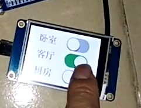

------------

9.九宫格全英文输入（支持串口打印字符）
~~~~~~~~~~~~~~~~~~~~~~~~~~~~~~~~~~~~~~~~~~~~~~~~~~~~~~~~~~~~~~~~~~~~~~~~~~~~~

素材说明：
    极简九宫格全英文输出（支持串口打印字符）
    对于小于3.5寸的小屏如果做全键盘会影响触摸体验，因为键太多屏幕不够大只能缩小按键尺寸，影响视觉体验和触摸体验。九宫格键盘可以解决这个问题，10个按键布局实现全键盘的功能。数字，英文均可输入。您值得尝试一下!

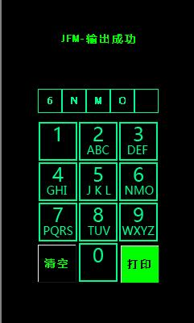

------------

10.酷炫Loading进度条界面
~~~~~~~~~~~~~~~~~~~~~~~~~~~~~~~~~~~~~~~~~~~~~~~~~~~~~~~~~~~~~~~~~~~~~~~~~~~~~

素材说明：
    酷炫Loading进度条界面
    为节约FLASH空间本实例没有使用切换整图来实现动画，而是使用单个小图片元素通过定时器来实现超炫动画效果

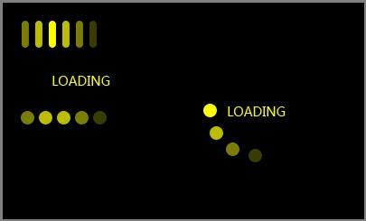

------------

11.86面板智能家居
~~~~~~~~~~~~~~~~~~~~~~~~~~~~~~~~~~~~~~~~~~~~~~~~~~~~~~~~~~~~~~~~~~~~~~~~~~~~~

素材说明：
    特别说:明对于单片机通讯方面，每个人的方法都不一样
    所以我的通讯协议大家未必适合，大家可以用自己的方法实现单片机的控制

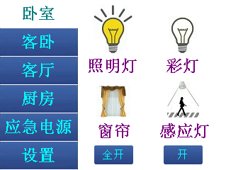

------------

12.简洁圆形数字键盘（支持全局输入）
~~~~~~~~~~~~~~~~~~~~~~~~~~~~~~~~~~~~~~~~~~~~~~~~~~~~~~~~~~~~~~~~~~~~~~~~~~~~~

素材说明：
    简洁圆形数字键盘（支持全局输入）

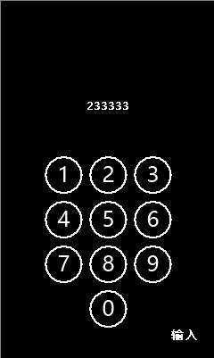

------------

13.多种控件效果
~~~~~~~~~~~~~~~~~~~~~~~~~~~~~~~~~~~~~~~~~~~~~~~~~~~~~~~~~~~~~~~~~~~~~~~~~~~~~

素材说明：
    在同一个页面中实现下拉列表框效果，并支持滚动条

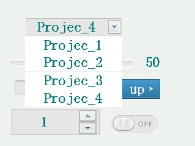