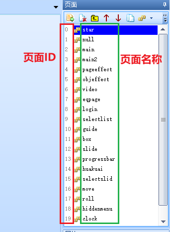

page-页面跳转指令
===============================================================

如上图所示，红色框内为页面ID，绿色框内为页面名称
 

.. tip:: 以上图为例，main页面的ID为2，因此如果要跳转到main页面，可以使用page 页面名称或者page 页面ID

 - page main
  
 - page 2
    
 - 也可以对系统变量dp赋值来实现跳转页面(如dp=2)，系统变量dp可以设置可以读取，具体请参看系统变量列表。

.. attention:: 写在page指令后面的代码将被忽略没机会执行。

